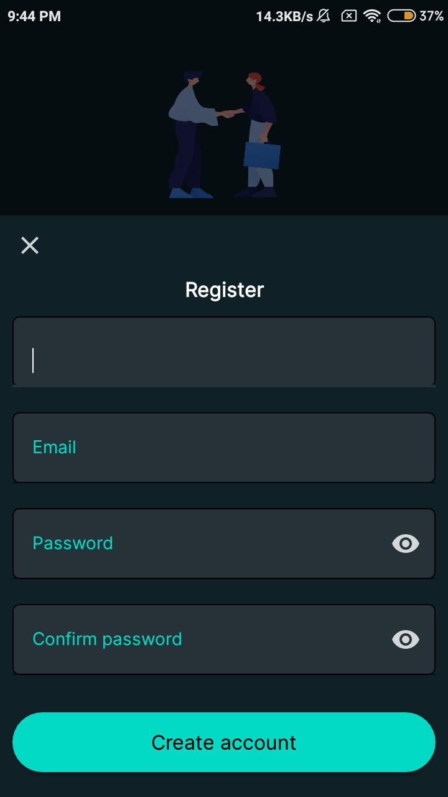

  
<h1 align="center">Crazie - Social media app</h1>  

Crazie is inspired by <b><a href="http://instagram.com">@instagram</a></b>

# Screenshots
 | 
--- | ---
 | 
 | 

# Third-party libraries

<h3>Firebase</h3><a href="https://github.com/firebase/quickstart-android">Firebase Sever</a>

<h3>Transition button</h3> <a href="https://github.com/roynx98/transition-button-android">roynx98/transition-button<a>

  

<h3>Circular ImageView</h3><a href="https://github.com/hdodenhof/CircleImageView">Circular ImageView</a>

<h3>Glide</h3><a href="https://github.com/bumptech/glide">Glide image fetcher</a>

<h3>Image Cropper</h3><a href="https://github.com/ArthurHub/Android-Image-Cropper">Image cropper</a>

# Credits
## Icons & Vectors
<ul>
  <li><a href="https://www.flaticon.com/">Flat Icons</a></li>
  <li><a href="https://icons8.com/">Icons8</a></li>
  <li><a href="https://www.freepik.com/">Freepik</a></li>
</ul>

# References

<h3>Reference :: KOD Dev</h3><a href="https://youtube.com/playlist?list=PLzLFqCABnRQduspfbu2empaaY9BoIGLDM">Instagram clone playlist</a>

